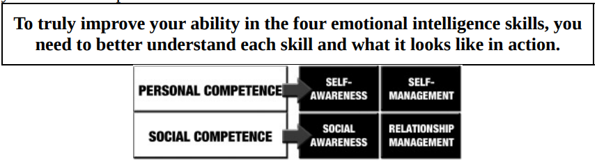

# Emotional Intelligence 

## **Chapter 1**  
A story how a guy fight back shark using his EQ and saving himself from death, but getting paralyzed.

## **Chapter 2** 
Importance of EQ in person's life as it helps them to this and act differently and smartly in situations.

## **Chapter 3**  
</img>  
**1.** The only way to genuinely understand your emotions is to spend enough time thinking through them to figure out where they come from and why they are there.  
**2.** Self-management is your ability to use your awareness of your emotions to stay flexible and direct your behavior positively. This means managing your emotional reactions to situations and people.  
**3.** Social awareness is your ability to accurately pick up on emotions in other people and understand what is really going on with them. This often means perceiving what other people are thinking and feeling even if you do not feel the same way. 
Listening and observing are the most important elements of social awareness. To listen well and observe what’s going on around us, we have to stop doing many things we like to do. We have to stop talking, stop the monologue that may be running through our minds, stop anticipating the point the other person is about to make, and stop thinking ahead to what we are going to say next. It takes practice to really watch people as you interact with them and get a good sense of what they are thinking and feeling. At times, you’ll feel like an anthropologist. Anthropologists make their living watching others in their natural state without letting their own thoughts and feelings disturb the observation.   
**4.** Relationship management is your ability to use your awareness of your own emotions and those of others to manage interactions successfully. This ensures clear communication and effective handling of conflict. 
