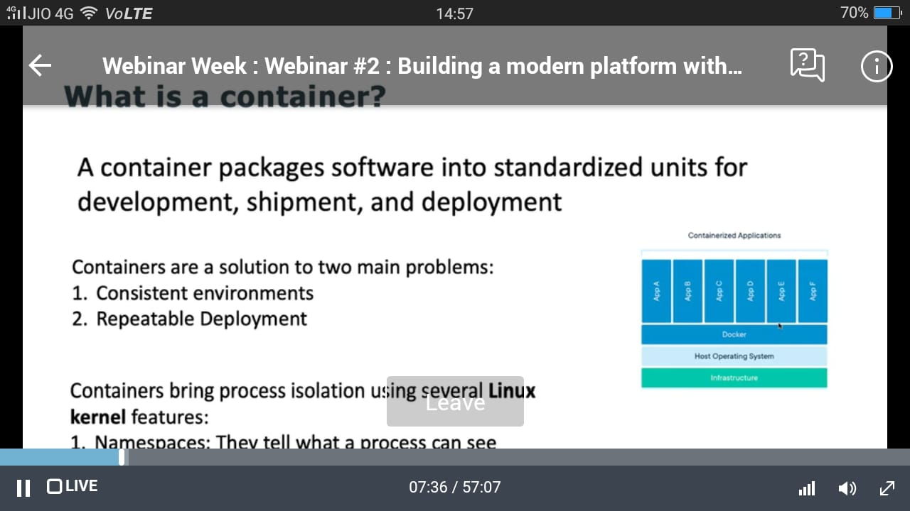

# Kubernetes
Speaker : **Shekhar Gulati,CTO - XEBIA & Akshay Mathur Principal Consultant - XEBIA**
## LEAN ON LEARNING
28 April,2020

## Webinar SS
 
 
 
 
 
 
 
 
 
 
 
 
 
 
 
 
 
 
 
 
 
 
 
 
 
 
 
 
 
 
 
 
